

      
  

<b>N-Zik</b> is a multilingual fork of <a href="https://github.com/knighthat/Kreate">Kreate</a>, built with UI/UX improvements and new features in mind.
  

<strong>N-Zik</strong> may not yet be as stable as the original <a href="https://github.com/knighthat/Kreate">Kreate</a>, so feel free to use the original if you need a more mature alternative.

I'm still learning Kotlin, but I typically push updates every Sunday at 0AM when possible.

   
  
 

[)](https://github.com/NEVARLeVrai/N-Zik/releases)  

 

# 🎧 Features

- 🌍 **Multilingual support** — English, Italian, German, Russian, French, Spanish, Czech, Turkish, Romanian, and more. Contributions welcome!
- 🎨 **Modern & friendly UI design**
- 🌓 **UI Mode toggle** — Switch between **N-Zik** and classic **ViMusic** styles
- 💾 **Automatic caching** — Songs are auto-cached for offline playback with customizable cache size
- 📥 **Downloads** — Download individual songs or entire playlists for full offline access (beyond cache)
- ▶️ **Background playback** — Keep the music going while using other apps
- 📊 **Listening stats** — Track your listening habits and preferences
- 🌈 **Audio visualizer** — Stunning effects and real-time animations
- 🕹️ **Discord Rich Presence** — Show your currently playing track directly on your Discord profile

   
   

> [!NOTE]
> 🎤 This feature requires **microphone access** and must be enabled in settings.

- 📰 **News feed** — Discover moods, genres, and new albums from your favorite artists
- 🔄 **Import/Export playlists** — Share RiMusic playlists online with friends
- ✍️ **Lyrics** — Fetch, display, edit, and translate synced or unsynced song lyrics
- 🎭 **Custom themes** — Personalize your experience with theme options
- ⏲️ **Sleep timer** — Auto-stop playback after a customizable duration
- 🎚️ **Audio controls** — App & device volume, playback speed, pitch, normalization, skip silence
- 📺 **Wide compatibility** — Android Auto, Android TV, and YouTube video support
- 🧪 **Experimental widgets**
- 🔁 **Update checker** — Optional automatic update notifications
- 📤 **Export media** — Save your cached/downloaded music externally
- ⚙️ **Export settings** — Back up and restore your preferences
- 📡 **Offline ready** — Enjoy your music even without an internet connection

# 📷 Screenshots

    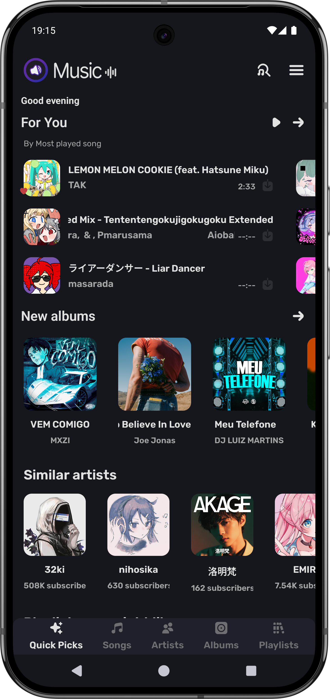
    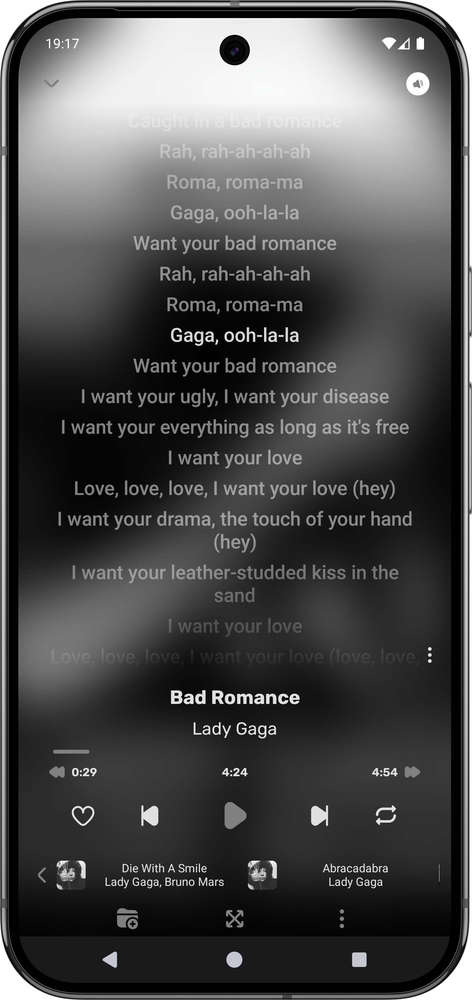
    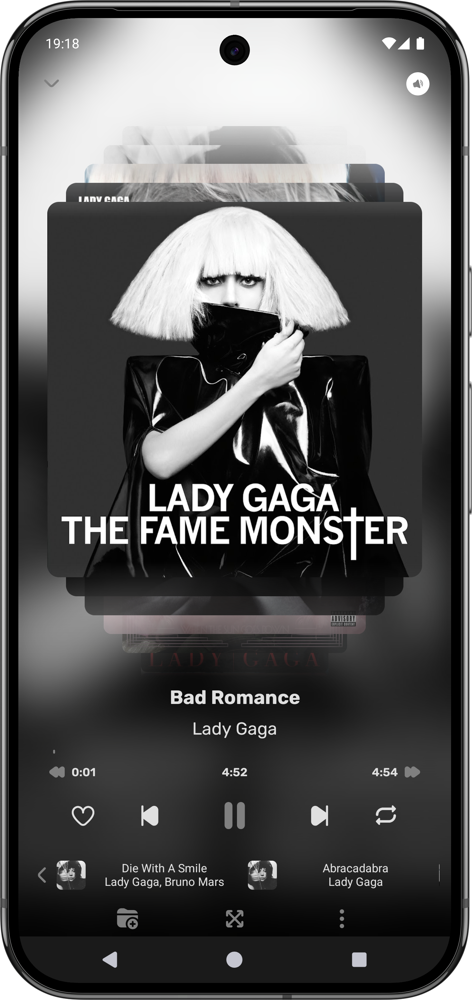
    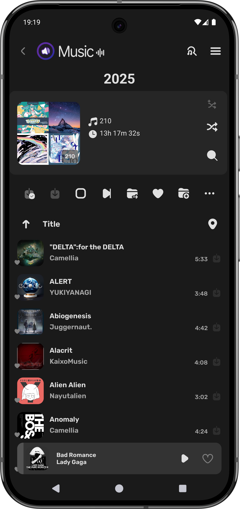
    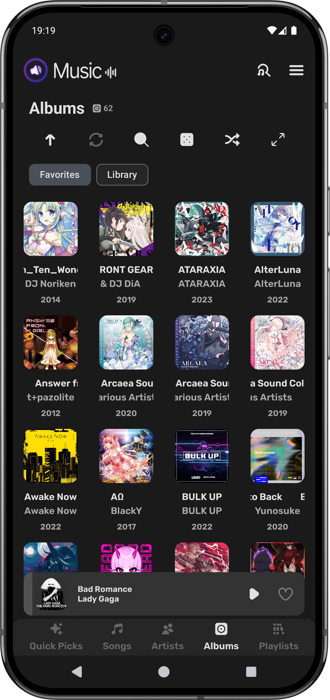
    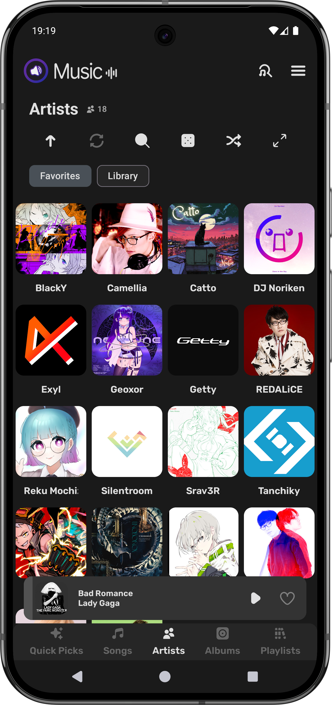
    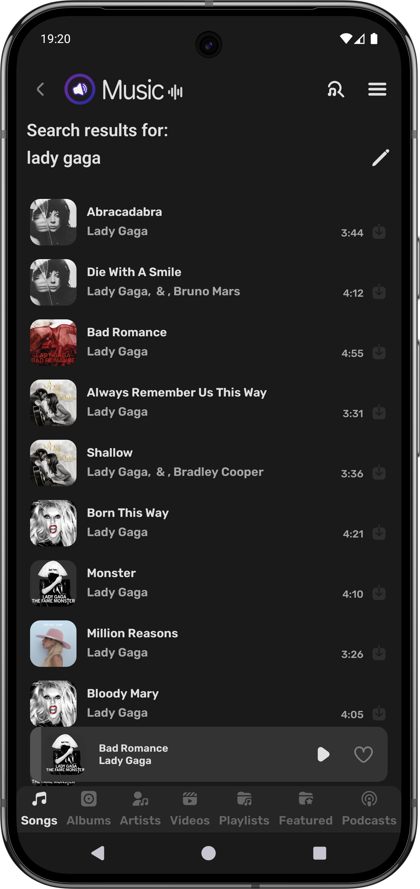
    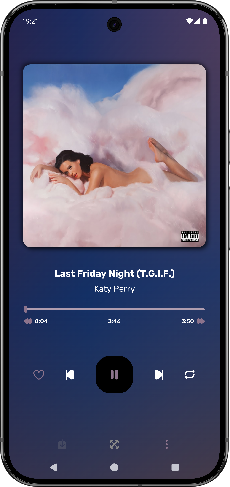
    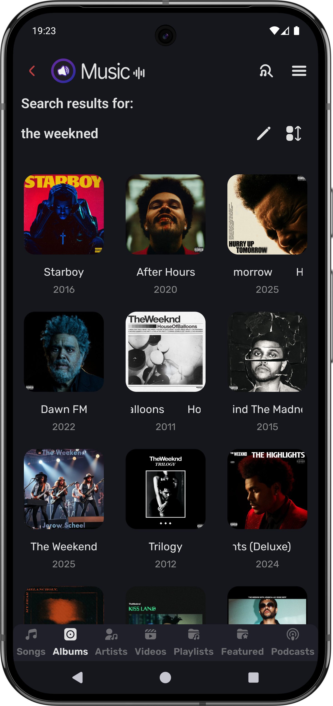
    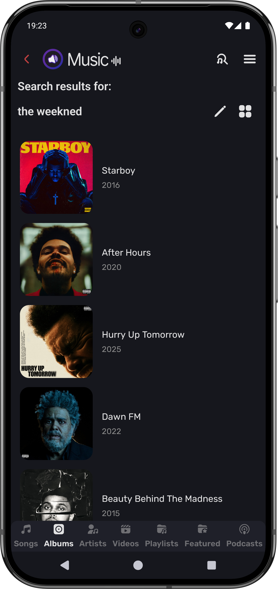
    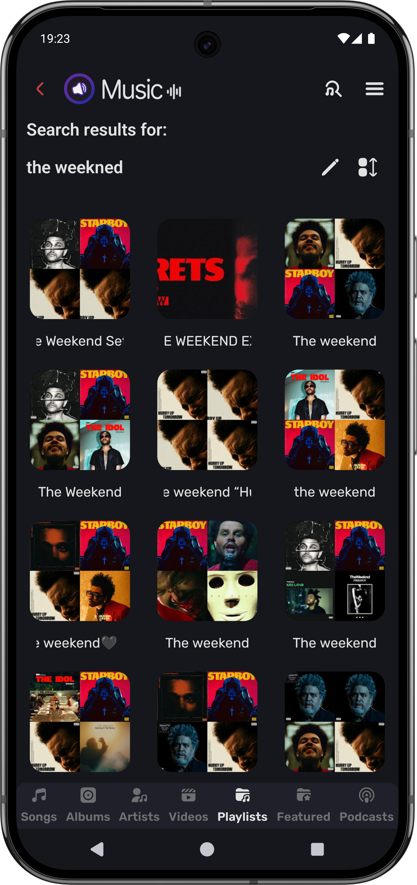
    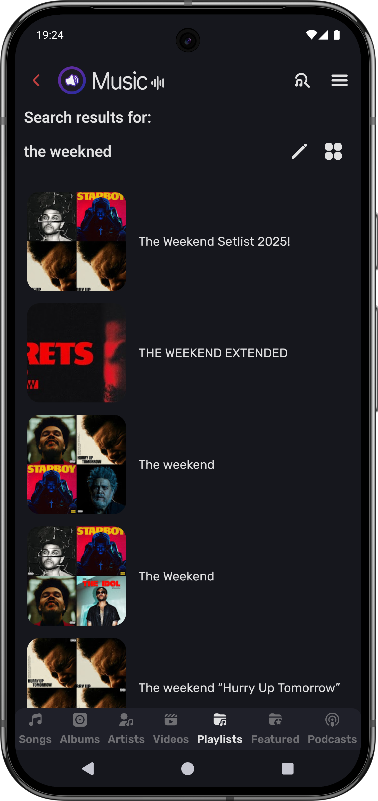
    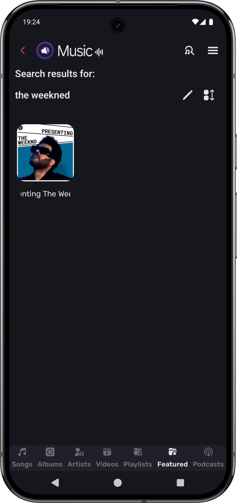
    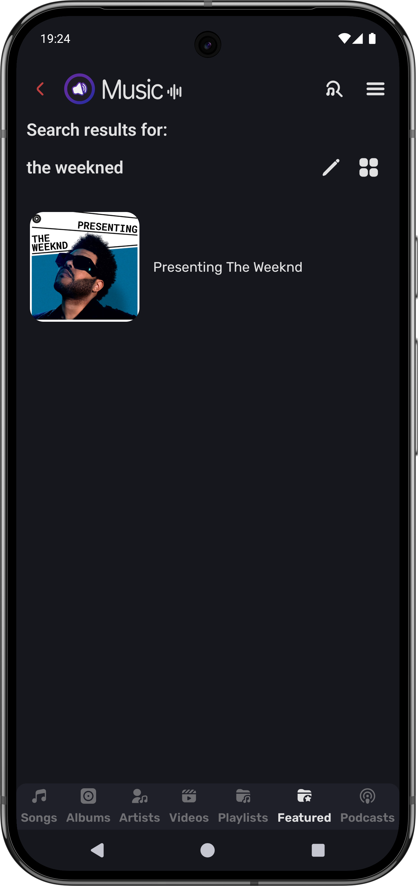
    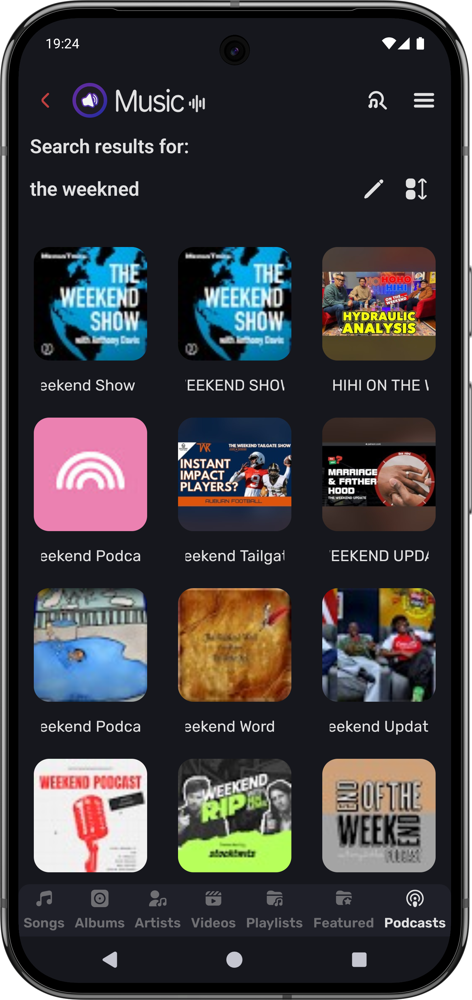
    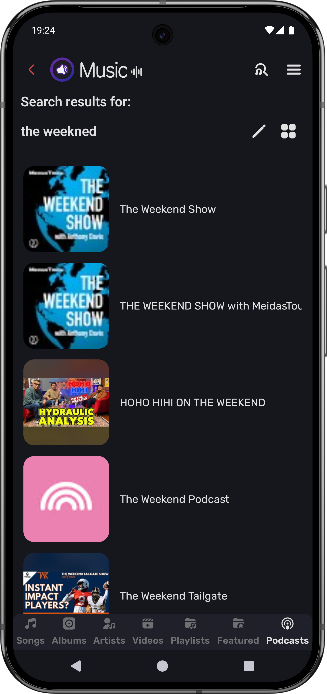

# 🌐 Supported Languages

Thanks to all our amazing contributors!  
Here are the languages currently supported:

- 🇿🇦 **Afrikaans** — [HelloZebra1133](https://crowdin.com/profile/HelloZebra1133)  
- 🇸🇦 **Arabic** — [ABS zarzis](https://crowdin.com/profile/abszar), [Ahmad Al Juwaisri](https://crowdin.com/profile/juwaisri)  
- 🇦🇿 **Azerbaijani** — [Nizami Səmidov](https://crowdin.com/profile/nizamismidov4), [Notesuree](https://github.com/Notesuree)  
- 🇧🇩 **Bangla** — [Ann Naser Nabil](https://github.com/AnnNaserNabil)  
- 🇷🇺 **Bashkir** — [Shilave malay](https://crowdin.com/profile/Bash.boy)  
- 🇪🇸 **Catalan** — [Adrià Martínez](https://crowdin.com/profile/marxally), [Aniol](https://crowdin.com/profile/aniol), [EMC_Translator](https://crowdin.com/profile/EMC_Translator)  
- 🇨🇳 **Chinese (Simplified)** — [benhaotang](https://crowdin.com/profile/benhaotang), [SharkChan0622](https://github.com/SharkChan0622)  
- 🇹🇼 **Chinese (Traditional)** — [YeeTW](https://github.com/yjcTW), [SharkChan0622](https://github.com/SharkChan0622)  
- 🇨🇿 **Czech** — [ikanakova](https://github.com/ikanakova), [JZITNIK-github](https://github.com/JZITNIK-github)  
- 🇩🇰 **Danish** — [cultcats](https://crowdin.com/profile/cultcats)  
- 🇳🇱 **Dutch** — [BabyBenefactor](https://crowdin.com/profile/BabyBenefactor)  
- 🇺🇸 **English** — [Alejandro Moctezuma](https://crowdin.com/profile/alejandromoc), [twistios](https://crowdin.com/profile/twistios), [Smk90](https://crowdin.com/profile/smk90), [CanIn](https://crowdin.com/profile/canin), [koliwan](https://crowdin.com/profile/koliwan), [Glich440](https://github.com/Glich440), [fast4x](https://github.com/fast4x)  
- 🌍 **Esperanto** — [kefiiris](https://github.com/kefiiris)  
- 🇪🇪 **Estonian** — [beez276](https://crowdin.com/profile/beez276)  
- 🇵🇭 **Filipino** — [Clyde-Timonera](https://github.com/Clyde-Timonera)  
- 🇫🇮 **Finnish** — [Smk90](https://crowdin.com/profile/smk90), [rikalaj](https://crowdin.com/profile/rikalaj)  
- 🇫🇷 **French** — [Mickael81](https://crowdin.com/profile/mickael81), [esophagusdecency](https://crowdin.com/profile/esophagusdecency), [NEVARLeVrai](https://github.com/NEVARLeVrai)  
- 🇪🇸 **Galician** — [zordor](https://crowdin.com/profile/zordor), [ninjum](https://crowdin.com/profile/ninjum)  
- 🇩🇪 **German** — [twistqj](https://crowdin.com/profile/twistqj), [nitro4542](https://crowdin.com/profile/nitro4542), [twistios](https://crowdin.com/profile/twistios), [Eddisch](https://crowdin.com/profile/eddisch2010), and more...  
- 🇬🇷 **Greek** — [Marinkas](https://github.com/Marinkas)  
- 🇮🇱 **Hebrew** — [opcitgv](https://crowdin.com/profile/opcitgv), [TheCreeperDuck](https://crowdin.com/profile/thecreeperduck)  
- 🇮🇳 **Hindi** — [NikunjKhangwal](https://crowdin.com/profile/nikunjkhangwal), [Sharunkumar](https://crowdin.com/profile/sharunkumar), [Th3-C0der](https://github.com/Th3-C0der)  
- 🇭🇺 **Hungarian** — [Zan1456](https://crowdin.com/profile/Zan1456), [Ndvok](https://crowdin.com/profile/ndvok)  
- 🇮🇹 **Italian** — [Fabio Iotti](https://crowdin.com/profile/bruce965), [CiccioDerole](https://crowdin.com/profile/CiccioDerole), [fast4x](https://github.com/fast4x)  
- 🇮🇩 **Indonesian** — [luthfialfarabi](https://crowdin.com/profile/luthfialfarabi), [teddysulaimanGL](https://github.com/teddysulaimanGL)  
- 🌐 **Interlingua** — [softinterlingua](https://github.com/softinterlingua)  
- 🇯🇵 **Japanese** — [maboroshin](https://crowdin.com/profile/maboroshin), [Mid_Vur_Shaan](https://crowdin.com/profile/Mid_Vur_Shaan)  
- 🇰🇷 **Korean** — [ZeroZero00](https://crowdin.com/profile/ZeroZero00), [TsyQax](https://crowdin.com/profile/TsyQax)  
- 🇳🇴 **Norwegian** — [Xyrcon](https://crowdin.com/profile/xyrcon)  
- 🇮🇷 **Persian** — [CUMOON](https://github.com/CUMOON)  
- 🇵🇱 **Polish** — [Krzysztof](https://crowdin.com/profile/scrummybingus), [AntoniNowak](https://crowdin.com/profile/AntoniNowak), and more...  
- 🇵🇹 **Portuguese (Portugal)** — [ManuelCoimbra](https://crowdin.com/profile/ManuelCoimbra)  
- 🇧🇷 **Portuguese (Brazil)** — [vs-machado](https://crowdin.com/profile/vs-machado), [xSyntheticWave](https://crowdin.com/profile/xSyntheticWave), [NEVARLeVrai](https://github.com/NEVARLeVrai)  
- 🇷🇴 **Romanian** — [OrangeZXZ](https://github.com/OrangeZxZ)  
- 🇷🇺 **Russian** — [Eddisch](https://crowdin.com/profile/eddisch2010), [Alnoer](https://crowdin.com/profile/Alnoer), [siggi1984](https://github.com/siggi1984), and more...  
- 🇷🇸 **Serbian (Cyrillic & Latin)** — [IvanMaksimovic77](https://github.com/IvanMaksimovic77)  
- 🇪🇸 **Spanish** — [Alejandro Moctezuma](https://crowdin.com/profile/alejandromoc), [DanielSevillano](https://github.com/DanielSevillano), and more...  
- 🇱🇰 **Sinhala** — [VINULA2007](https://crowdin.com/profile/VINULA2007)  
- 🇸🇪 **Swedish** — [sebbe.ekman](https://crowdin.com/profile/sebbe.ekman)  
- 🇹🇷 **Turkish** — [abfreeman](https://github.com/abfreeman), [mikropsoft](https://github.com/mikropsoft), and more...  
- 🇺🇦 **Ukrainian** — [Avin](https://crowdin.com/profile/avinateachip), [Crayz310](https://github.com/Crayz310), and more...  
- 🇻🇳 **Vietnamese** — [teaminh](https://crowdin.com/profile/teaminh)  

> ❓ Don't see your language? [Request it here](https://crowdin.com/project/N-Zik) or contribute below!

---

# 📲 Installation

**Stable versions are available here:**  
  

**Beta versions are available here:**  

# 🤝 Contributing

## 🛠️ Improve the App

Pull requests are welcome!  
Feel free to fix bugs, enhance features, or suggest new ideas.

## 🌍 Help Translate

Want to:
- Translate into a new language?
- Improve an existing translation?
- Fix typos or inconsistencies?

Join us on Crowdin!

# 🫂 Acknowledgements

### 🛠 Based on / Inspired by:
- [**Kreate**](https://github.com/knighthat/Kreate)
- [**RiMusic**](https://github.com/fast4x/RiMusic)
- [**ViMusic**](https://github.com/vfsfitvnm/ViMusic)

### 🎨 Design & UI Contributions:
- Current banner and logo [OrangeZXZ](https://github.com/OrangeZXZ), [NEVARLeVrai](https://github.com/NEVARLeVrai)
- RiMusic previous logo and many current icons: [jaimtres](https://github.com/jaimtres)
- Player design: [aneesh1122](https://github.com/aneesh1122)
- App logo: [MedieroAF](https://github.com/MedieroAF)
- Icons: [**Ionicons**](https://github.com/ionic-team/ionicons), [**FlatIcon.com**](https://www.flaticon.com)

### 🎵 Lyrics & Media:
- [**KuGou**](https://www.kugou.com) – Lyrics provider
- [**LrcLib**](https://lrclib.net) – Lyrics provider

### 🧠 Features & Tools:
- [**YouTube-Internal-Clients**](https://github.com/zerodytrash/YouTube-Internal-Clients): Script for discovering hidden YouTube API clients.
- [**Translator**](https://github.com/therealbush/translator): Google Translate wrapper for Kotlin/JVM.
- [**compose-markdown**](https://github.com/jeziellago/compose-markdown): Markdown rendering in app.
- [**HypnoticCanvas**](https://mikepenz.github.io/HypnoticCanvas/): Shader effects for Compose.
- [**Kizzy-RPC**](https://github.com/dead8309/KizzyRPC): Discord RPC presets.
- [**echo-discord**](https://github.com/brahmkshatriya/echo-discord): Fixes for Discord artwork upload/loading.

# 👀 Status

## 🛠️ Build & Deployment
  
  
  

## 🔄 Automation & Maintenance
  
  
  
  
  

## 🌐 Localization
  

## 👥 Contributors

# ⚠️ Disclaimer

This project is built on top of [Kreate](https://github.com/knighthat/Kreate), but has no relation to the original author.

Furthermore, its contents are not affiliated with, funded, authorized, endorsed by, or in any way associated with YouTube,  
Google LLC, or any of its affiliates or subsidiaries.

Any trademarks, service marks, trade names, or other intellectual property rights used in this project remain the property of their respective owners.

Made with ❤️ by [NEVARLeVrai](https://github.com/NEVARLeVrai)  
Licensed under GPLv3 - see [LICENSE](LICENSE)  
